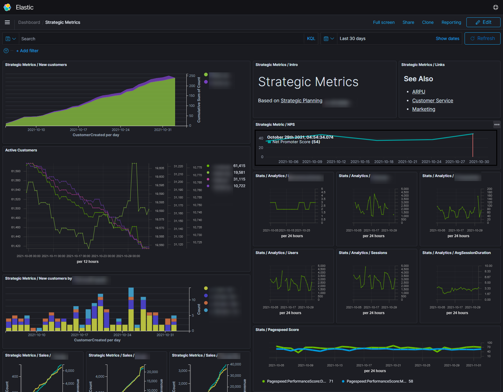
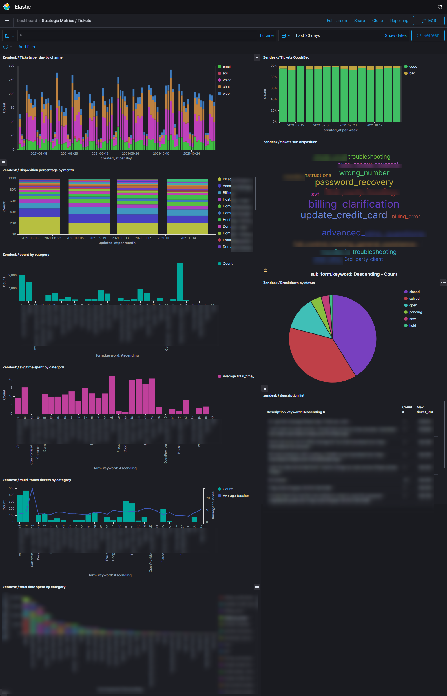

### Business Intelligence At Rebel

◆ Introduced new data concepts, building on existing approaches to help us achieve better, wider reporting. Lead development and contributed to <abbr title="Extract Transform Load">ETL</abbr> from many sources into data platform. This further evoloved into datalake concepts to bring data in from all sources to cross-reference and create more meaning and insight. Introduced Elasticsearch and Kibana early to provide a framework for both Business Intelligence and Search combined with deeper product usage metrics. 

◆ Extracted data from a wide range of sources including core business SQL database (MSSQL), accounting software (Business Central), Salesforce, Zendesk (Customer Service), Google Analytics, GoogleAds, Target Process (Workflow). This enabled cross-referencing between datasets and more usefulness in data exploration and analysis. 

◆ For operations and devops teams, introduced and advanced existing concepts of logging into centralized logging, metrics, dashboards and alerts.  Driven from core concepts of continual improvement, shorter feedback cycles and transparency and leading to direct wins like user experience improvements, better security and cost savings. 

◆ With a growing disdain for "free" hosted web traffic, analytics and event tracking systems, rolled out user-event tracking system and integrated throughout front end application. Recaptured ownership over data and control over coding and implementation. 

◆ Developed alternate searchable views of data for Customer Service for single-interface search for Customers, Products and Sales with &lt; 10ms response times. 

◆ Adopted newest and most useful cloud tools across AWS and <abbr title="Google Cloud Platform">GCP</abbr> for streaming, transforming and storing data. 

◆ Having many years of background in marketing technology, I brought an advanced understanding of managing marketing data and automation. I helped the marketing team cover the basics and itermediate integration coverage, then evolved marketing automation systems to integrate with user behaviour data and user events to trigger marketing automation events proved to be useful tools when operating in a competitive marketing with limited resources for customer acquisition and activation. Also brought in a variety of user experience testing tools and methodologies.  

### Promoting data literacy at Rebel

◆ Building data literacy is a part of building a culture of learning and experimentation. We give space to work through the scientific method and encourage use of data and evidence. This needs empowerment of all employees with access to data to use within weekly improvement cycles, monthly demonstrations and yearly and multi-year trend analysis. We've talked about it in concert with Modern Agile and Devops concepts to support short continual improvement and short feedback cycles.

◆ More specific activities include: hosting lunch and learns, one-on-one training and co-build sessions; trainining course; work with all departments to build capacity throughout the organization to create searches, visualizations and dashboards. 

◆ Over time we saw more and more data driven results and decisions. More instances where staff brought ideas forward leading with evidence. 

◆ Created position for data analysis intern to focus on customer insights. With our learnings from the intern position, instead of investing more cash into advertising, we developed a marketing data analyst position.  Developed marketing data analyst position to develop and advance customer acquisition strategies. This data analyst test worked very well to test candidates. 

### Foundations of a career driven by evidence and data analytics

◆ With 15 years exprience working at digital agencies as technical director I gathered a lot of knowledge and experience with Enterprise content management, Marketing automation, Web analytics, Search and all the integrations therein.

◆ One of the last projects at bv02, was an amazing program that turned into [Sprig Learning](https://www.spriglearning.com/). It had many aspects of data analysis and reporting with an interesting element of cultural sensitivity to indigienous early-childhood learning. I learned the hard way to listen more when it comes to understanding how people want to interact with data. 

◆ Leading and managing digtial agencies for many years developed a passion for resource management and tracking team performance. While rooted in agile and a strong understanding of how high-funcitoning teams, I always felt strongly data driven conventions, tools and dashboards to help teams perform and continually improve. While I may not take the same approach today, I spent many hours analyzing resource planning data to understand how agencies perform - who are the best clients, who are the best managers, who are the best workers, what types of projects are most profitable, and so on. 

◆ I ran many projects where the product was a data anlaytics, reporting, or search portal. I worked with many data types, technologies and may types of organizations and teams.  I have a very good understanding of how to work with others - and direct teams - to get the most out of data. 