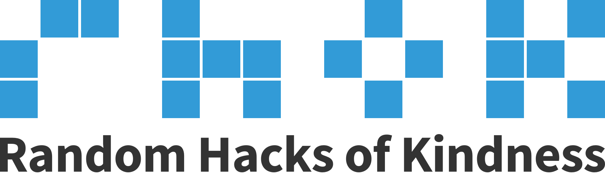
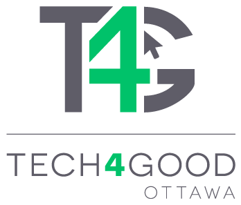
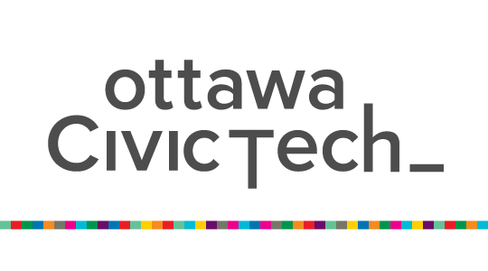

I have always felt that being a contributing citizen has been an important part of my personal and professional development. I've contributed in lots of different ways and contributing my skills in my area of expertise has been the most effective. As I built on that, I found leading a company or representing a sector and building a community of advocates and participants is even that much more effective. As I grow I want to continue to find bigger and more effective ways to make the most impact. 

## In the community

Random Hacks of Kindness is a hackathon for social good that brings together volunteer developers and tech-savvy do-gooders to work with charities, community groups and social enterprises. We ran over 10 events, sometimes twice per year.  I was a part of it form the beginning and lead the last ~6 events. 

This [twitter story from our April 2019 event](https://twitter.com/i/events/1126167856587202560) is a really good running narrative of the event. If you liked that check out [October 2018](https://twitter.com/i/events/1051648458371682304) and [October 2018](https://twitter.com/i/events/919998663270678528).

The videos on our [YouTube channel](https://www.youtube.com/channel/UCx49ToWxWeGgAFok-jqkjQQ/videos) really show the energy [and fun](https://youtu.be/0hFfUELfGW0?t=2128) at [kickoff](https://youtu.be/wNuMyE6Pt1o?t=1533) and at the [finale](https://youtu.be/Ln9xLQk4XJw?t=2479). 

As you can see, after watching all the videos on the youtube channel, I took the opportunity to speak to my philosophies and why I felt these events are important. 

[Tech4Good Ottawa](https://tech4goodottawa.ca/) was a chapter based initiative to bring together tech sector and social sector in Ottawa. It was based on the [NTEN community groups](https://my.nten.org/s/group/CollaborationGroup/00B1U00000C5ey8UAB) and [Techsoup netsquared](https://www.techsoup.ca/community/netsquared) models. We hosted events like evening networking events with speakers and panels or daytime lunch and learns.  We [livestreamed](https://www.facebook.com/watch/tech4goodott/) a few of the later events. 

[Ottawa Civic Tech](https://ottawacivictech.ca/) is a vibrant collection of folks across private sector, public sector, and academia. In Ottawa, being a federal government town, we had good mix of sectors - where in other cities you wouldn't have the same mix. I also felt it to be a smart nexus of folks and the right venue to collaborate with other engaged people that want to make their cities and communities a better place. I hosted many events in our space, brought in speakers, connected my other communities, and contributed to keeping it alive when interest waned.  

We kept connected to the national movement via [Code for Canada](https://codefor.ca/). I participate at national level by: hosting a panel at their national summit; volunteered as a technical interviewer in their fellowship program; and, consulted, during the pandemic, on how to get publicly contributed software to be open-source ready. 

## Changemaker program at Rebel

[The Changemaker program at Rebel](https://www.rebel.com/programs/changemaker) was an important program for me as I wanted experiment with the concept of evolving CSR into Creating Shared Value.  I wanted to see what happens when you integrate your company into the community around you via your service offering and staff. So we provide free services and education and integration for organizations that were doing important work in the world.  We offered it without barriers or strings attached. We designed websites; we made connections; if orgs were local we brought them into talk; we brought them into hackathons or connected them to other partners; and so on. 

## Providing leadership

I find I can make time and have meaningful, big impact in providing leadership to organizations, playing a technical advisory role. Its high-impact, low-time -  I temper the commitment by not being on the board, not committing to big coding projects (maybe some integration or prototyping 💪), making connections and backing out - and being really clear with my relationship.  I used this approch as an experiement in understanding how to have more and bigger impact.  

I'm currently helping out with:  [The Investigative Journalism Foundation](http://theijf.org/) and [Project In-Kind](https://www.projectinkind.org/) / [Kindvillage](https://www.kindvillage.com/). 

